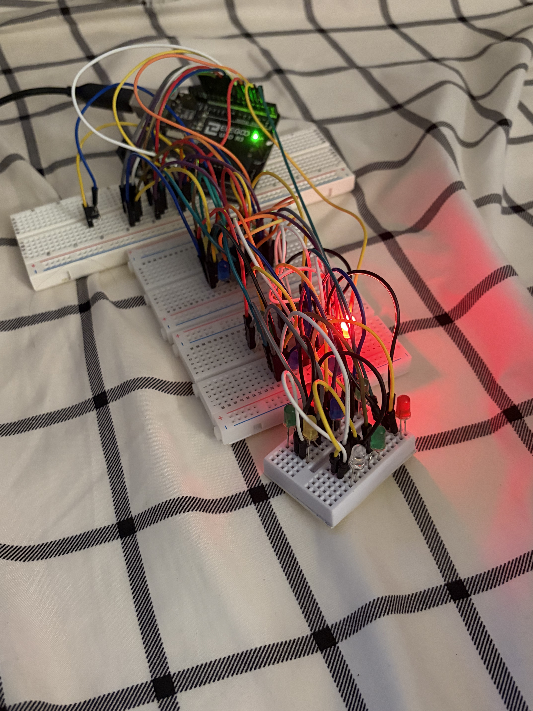
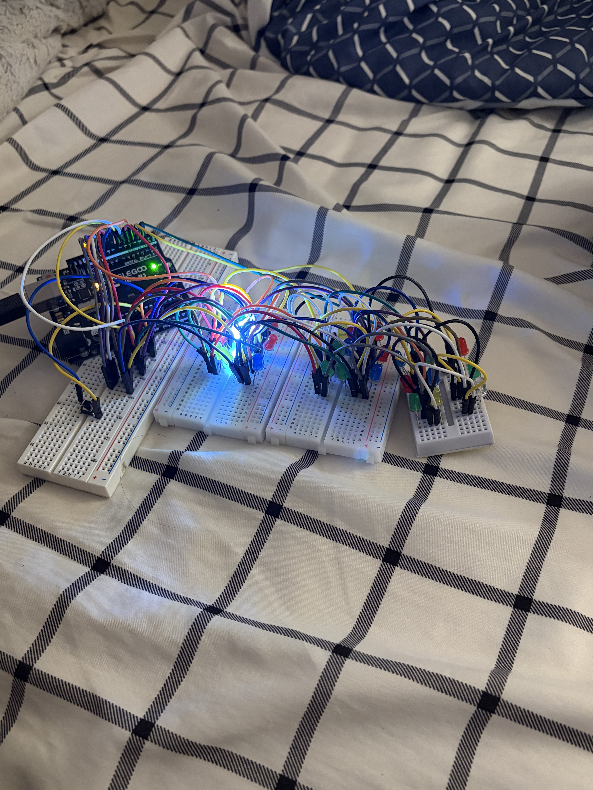

# 3x3x3-Led-Project

A 3×3×3 LED cube built with an Arduino Nano. The project uses multiplexing to control 27 LEDs using 12 Arduino output pins. The cube includes multiple lighting patterns and a button that allows the user to switch between patterns.

  
  

## Demo Videos

[Watch the LED Cube Demo 1](https://youtube.com/shorts/yR0XCdM4jZ8)

[Watch the LED Cube Demo 2](https://youtube.com/shorts/tc7hGbre6oI)

[Watch the LED Cube Terminal](https://youtu.be/xtZfcDtN4vY)

Features
3×3×3 LED cube with 27 LEDs
Arduino Nano control
Multiplexed LED control
Multiple LED patterns
Random pattern selection
Button-controlled pattern switching
Serial Monitor debugging
Graphical representation of the cube through printCube()
Modular pattern structure for easily adding new patterns
Current Patterns
Pattern 1 — Moving LED

Lights up one LED at a time and moves through the entire cube.

The LED moves through each layer:

1 → 2 → 3
4 → 5 → 6
7 → 8 → 9

Then it moves to the next layer.

Pattern 2 — Moving Row

Lights up an entire row across all three layers.

● ● ●
. . .
. . .

Then:

. . .
● ● ●
. . .

Then:

. . .
. . .
● ● ●

The pattern repeats continuously.

Pattern 3 — Moving Column

Lights up a column across all three layers.

● . .
● . .
● . .

Then:

. ● .
. ● .
. ● .

Then:

. . ●
. . ●
. . ●

The pattern then repeats.

Hardware
Components
Arduino Nano
27 LEDs
3×3×3 LED cube structure
9 negative/control connections
3 layer connections
Push button
Resistors
Breadboard
Jumper wires
Pin Configuration
LED Negative Pins
Cube Connection	Arduino Pin
neg1	5
neg2	6
neg3	7
neg4	8
neg5	9
neg6	10
neg7	11
neg8	12
neg9	13
Layer Pins
Layer	Arduino Pin
Layer 1	4
Layer 2	3
Layer 3	2
Button
Component	Arduino Pin
Button	A0

The button uses the Arduino's internal pull-up resistor:

pinMode(buttonPin, INPUT_PULLUP);

The button is connected between A0 and GND.

How the Cube Works

The cube is controlled using two groups of connections:

9 negative/control pins
3 layer pins

The wiring uses the following logic:

Negative pin HIGH → LED ON
Layer pin LOW     → Layer active
Layer pin HIGH    → Layer inactive

An LED is illuminated when its corresponding negative pin is HIGH and its layer is LOW.

Multiplexing

Because the Arduino does not independently control all 27 LEDs simultaneously, the program uses multiplexing.

Instead of keeping all three layers active at the same time, the program rapidly switches between them:

Layer 1 → Layer 2 → Layer 3 → Layer 1 → ...

Each layer is active for a very short amount of time:

delay(7);

The switching happens quickly enough that the LEDs appear to be continuously illuminated.

For example, when displaying a vertical column:

Layer 1     ●
Layer 2     ●
Layer 3     ●

the Arduino rapidly cycles through the layers, creating the appearance that all three LEDs are lit simultaneously.

Software Structure

The program is designed so additional patterns can be added without modifying the existing patterns.

The main loop calls:

runPattern(currentPattern);

The pattern is selected using:

switch(pattern)

For example:

case 0:
    movingLED();
    break;

case 1:
    movingRow();
    break;

case 2:
    movingColumn();
    break;

A new pattern can be added by creating another case:

case 3:
    pattern3();
    break;

and then creating:

void pattern3() {

    // New pattern

}

The number of available patterns can then be updated:

If we are testing only one pattern, we assign it to that pattern

// Example:
//int currentPattern = 2;

Random Pattern Selection
int currentPattern = -1;

The program can randomly select between the available patterns.

For three patterns:

the possible values are:

0
1
2

The program also prevents the newly selected pattern from being the same as the currently running pattern.

Button Behavior

The button allows the user to immediately change patterns.

The behavior is:

Arduino starts
      ↓
Random pattern selected
      ↓
Pattern runs
      ↓
Pattern finishes
      ↓
Same pattern repeats
      ↓
Button pressed?
   ↙       ↘
 No         Yes
 ↓           ↓
Repeat    Random new pattern
             ↓
          Repeat
Serial Monitor Debugging

The Serial Monitor is used to debug the program and visualize what the Arduino believes is happening inside the cube.

The program uses:

Serial.begin(9600);

The printCube() function displays the current cube state.

X represents an illuminated LED:

LAYER 1
X . .
. . .
. . .

LAYER 2
. . .
. . .
. . .

LAYER 3
. . .
. . .
. . .

This allows the software state to be compared with the physical LED cube.

Testing

A test mode is included so individual patterns can be tested without removing the other patterns.

To test Pattern 1:

int currentPattern = 0

To test Pattern 2:

int currentPattern = 1

To test Pattern 3:

int currentPattern = 2

To return to random mode:

int currentPattern = -1
Future Improvements

Potential future patterns and improvements include:

Adding Pattern 3 and Pattern 4

Improved Serial Monitor visualization

Cleaner wiring and Multiplexing

Make soldering the Led Lights to make a 3x3x3 Led Cube

Lessons Learned

This project is being used to explore:

Arduino programming
Digital I/O
LED multiplexing
Arrays
Functions
Nested loops
Random number generation
Button input and debouncing
Serial debugging
Modular software design
Hardware/software debugging
